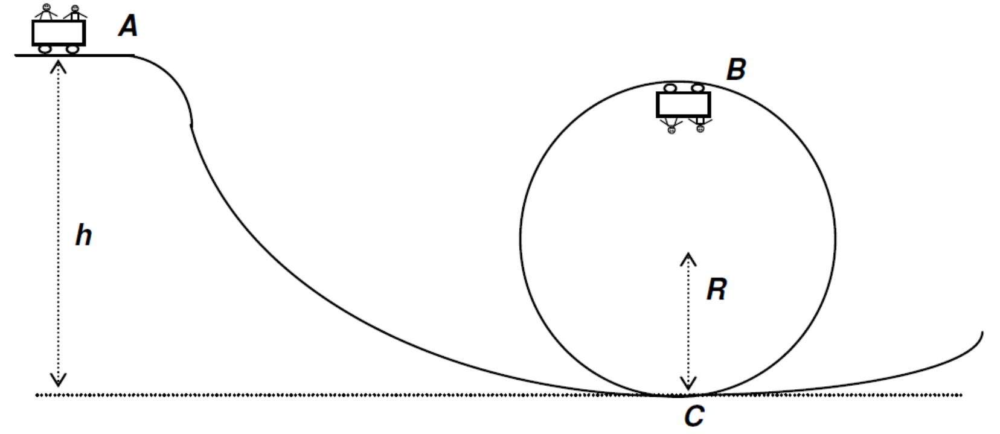
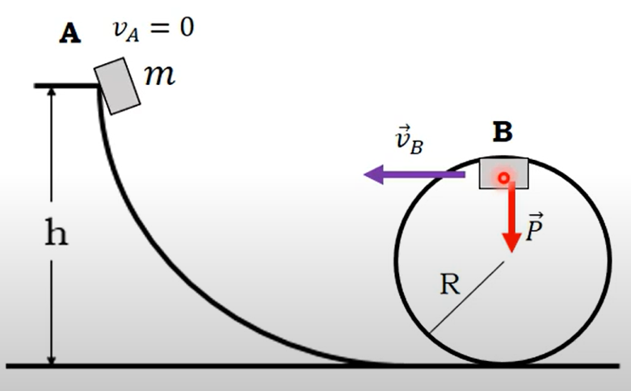

# Conservação de Energia Mecânica e o Problema do Looping

## Descrição Básica do Projeto
Este projeto é uma simulação criada para ilustrar o conceito de conservação de energia mecânica e seu papel no problema do looping. A ideia central é demonstrar como a energia potencial gravitacional é convertida em energia cinética enquanto um objeto percorre um looping circular.

**Um objeto atravessando um looping circular:**
Imagine um corpo que inicia seu movimento a partir de uma altura $h$ acima do topo de um looping de raio $R$. Este objeto possui energia potencial gravitacional no início e, à medida que se move, converte essa energia em energia cinética para completar o percurso no looping. Este projeto permite explorar como a altura inicial do corpo impacta sua habilidade de completar o looping.

O código foi implementado em Python, permitindo que os usuários configurem parâmetros como altura inicial para observar diferentes cenários.

<p align="center">
  
  <br>
</p>

## Conceitos de Física e Modelo Matemático

### Conservação de Energia Mecânica

Considere um carrinho de massa $m$ que percorre um loop vertical de raio $R$. O estudo deste problema pode ser iniciado com os conceitos de conservação de energia mecânica:

**Energia Mecânica Conservada:**
Quando apenas forças conservativas (como a gravidade) atuam, a energia mecânica total $E$ é conservada:

$$
E = T + V = \frac{1}{2} m v^2 + m g h,
$$

onde:
- $v$ é a velocidade do carrinho,
- $g$ é a aceleração da gravidade,
- $h$ é a altura em relação a um referencial escolhido.

**Condições para Permanecer no Loop:**
Para que o carrinho complete o loop sem perder contato com o trilho, a força normal na parte superior deve ser não negativa. Na posição mais alta ($h = 2R$), a força normal $N$ e a força gravitacional fornecem a força centrípeta necessária:

$$
\frac{m v^2}{R} = m g + N.
$$

Para $N \geq 0$, requer-se $v^2 \geq g R$ na parte superior. Combinando com a conservação de energia, a altura mínima inicial $h_0$ para completar o loop é:

$$
h_0 = \frac{5}{2} R.
$$

**Equação Diferencial do Movimento:**
Introduzindo as forças e acelerações em um loop genérico, o movimento pode ser descrito por:

$$
m \frac{d^2 s}{d t^2} = -\frac{\partial V}{\partial s} - \beta \frac{d s}{d t},
$$

onde:
- $s$ é a posição ao longo do trilho,
- $V(s)$ é o potencial gravitacional $V(s) = m g h(s)$,
- $\beta$ é o coeficiente de atrito proporcional à velocidade, se presente.

Esta EDO modela o movimento com dissipação. Se o atrito é desconsiderado ($\beta = 0$), a equação simplifica para:

$$
m \frac{d^2 s}{d t^2} = -m g \frac{\partial h(s)}{\partial s}.
$$

**Modelagem Com Dissipação (EDO):**
Para incluir dissipação energética, seja $F_{\text{não-cons.}} = -\beta v$. Assim, a energia mecânica decai no tempo:

$$
\frac{d E}{d t} = -\beta v^2.
$$

Combinando:

$$
\frac{d^2 s}{d t^2} + \frac{\beta}{m} \frac{d s}{d t} + g \frac{\partial h}{\partial s} = 0.
$$

Essa é uma EDO de segunda ordem.

### Trajetória no Looping

A partir da conservação de energia, a posição e a velocidade do objeto são calculadas em função do tempo. O movimento inclui uma descida vertical até a entrada no looping e, em seguida, um movimento circular descrito por:

$$
\theta = \arccos\left(\frac{y}{R}\right)
$$

onde $\theta$ é o ângulo no looping, $y$ é a altura atual, e $R$ é o raio do looping.

<p align="center">
  
  <br>
  <em>Figura 2: Simulação de looping.</em>
</p>

## Implementação

- **Linguagens e Pacotes:**
  Este projeto foi desenvolvido em Python, utilizando os pacotes:
  - **NumPy:** para cálculos matemáticos.
  - **PyGame:** para criação de animações.

## Como Usar

### Instalação e Dependências
1. Certifique-se de ter o Python 3.6+ instalado.
2. Instale os pacotes necessários com o comando:

```bash
pip install numpy
pip install pygame
```

### Execução da Simulação
1. Baixe o código.
2. Execute o script principal com:

```bash
python main.py
```

3. Configure os seguintes parâmetros no código, conforme desejado:
   - Altura inicial do objeto ($h$).
   - Raio do looping ($R$).
   - Aceleração da gravidade ($g$).

### Saída do Programa
O programa gera uma animação que mostra o movimento do objeto, destacando a a velociadade durante o percurso do looping.

## Informações sobre o Projeto
Este projeto foi desenvolvido por:

Vileno Cunha Cavalcante: vilenocavalcante@usp.br

## Referências
Silva, Nelson. (2015). Looping: solução da lagrangiana, simulação computacional e estratégias didáticas. Caderno Brasileiro de Ensino de Física. 32. 963. 10.5007/2175-7941.2015v32n3p963. 

